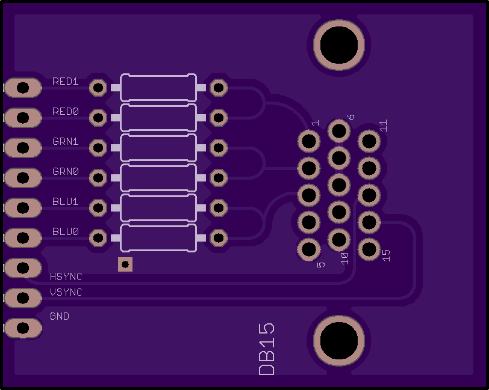

# Verilog code for MD-5 hash algorithm 
* Verilog implementaiton and testbench of the MD5 algorithm. The MD5 algorithm is implemented as a Moore state machine with 9 states.
* The top module `FGHI.v` takes as input a 128 byte hexadecimal representation of a string.
* The inputs are labelled `M_0[31:0]` through `M_15[31:0]`.
* The 16 byte hash value is output in clocked register `output[127:0]`.
* The testbench code for behavioural simulation is in the file labelled `tb_bench.v`

# Dual layered PCB Design for DB-15 connector
* The schematic of the dual layered PCB for the DB-15 VGA connector was designed using Eagle.
* 40 boards of the desgign were fabricated.
* The schematic is contained in the folder `PCB`.

